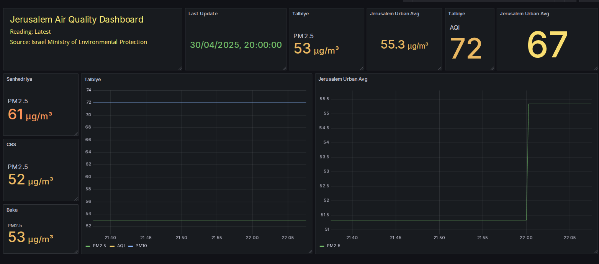
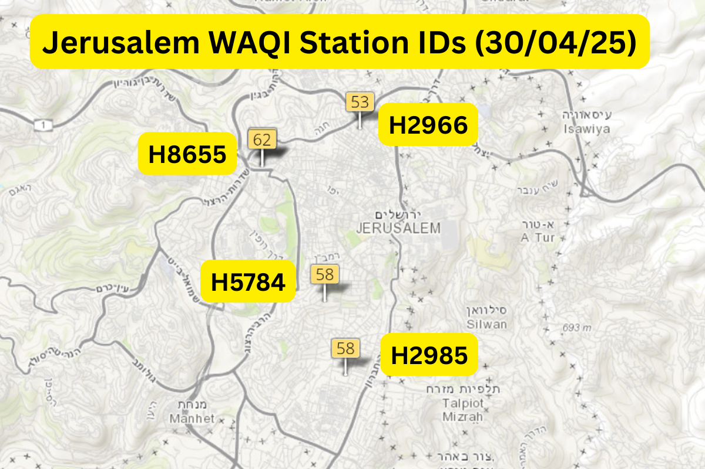
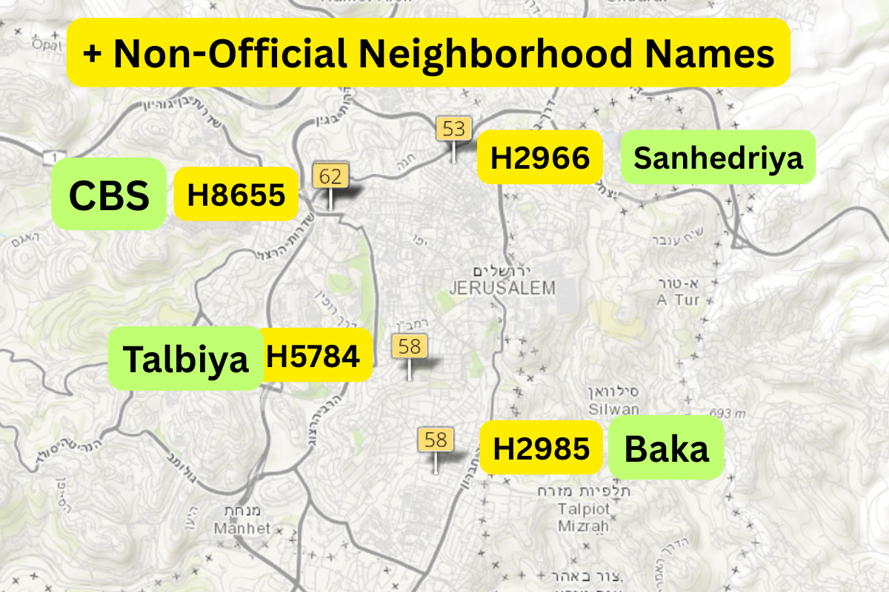

# WAQI Station IDs - Israel (Manual Survey)

 

This repository documents manually collected WAQI (World Air Quality Index) station IDs for several key locations in Israel. This data is useful for setting up automated queries to WAQI's air quality API.

The WAQI project aggregates real-time air quality data from national EPAs, including Israel's **Ministry of Environmental Protection (Misrad HaSvivah)**. This list is based on manual geolocation and observation of WAQI's map interface.

## Jerusalem Stations - Urban
 
 

 

---

| Station Name                 | Description / Notes                                         | Station ID |
|-----------------------------|-------------------------------------------------------------|------------|
| Central Bus Station         | Fixed monitor, non-portable; operated by Misrad HaSvivah    | H8655      |
| Sanhedriya | Near Bar Ilan intersection                                | H2966      |
| Talbiye       | Labelled "Jerusalem"; geographically central                | H5784      |
| Baka                        | Possibly mislabeled; appears in southern Jerusalem          | H2985      |

## Jerusalem Periphery

| Kfar Etzion                 | Near Gush Etzion; influenced by local conditions            | H2986      |

## Other Israel Stations

| Location        | Description / Notes                                     | Station ID |
|----------------|---------------------------------------------------------|------------|
| Modi'in         | Central Israel, lower readings during test period       | A46981     |
| Tel Aviv        | Representative urban station (not roadside)             | H5783      |
| Eilat (Aqaba)   | Only Eilat sensor, operated by Jordanian authorities    | H13052     |
| Beersheba       | High readings; southern Israel                          | H2978      |
| Ashkelon        | Central location                                        | H2972      |
| Ashdod (1)      | WAQI-listed station                                     | H10741     |
| Ashdod (2)      | Additional Ashdod sensor                                | H9992      |
| Ashdod (URAD)   | Non-governmental; private URAD monitor                  | H344437    |
| Netanya         | Israeli government source                               | H9995      |
| Hadera          | Israeli government source                               | H5742      |
| Pardes Hanna    | Israeli government source                               | H5782      |
| Haifa           | Israeli government source                               | H2950      |

## Notes

- **Station IDs** (e.g., `H8655`) are used in API queries and can be embedded into direct WAQI links like:
